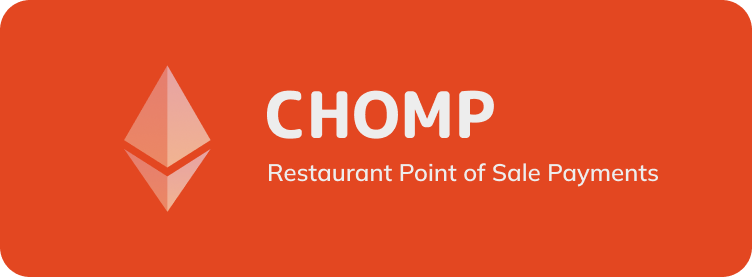

    

# Chomp

Chomp is a restaurant point of sale payment flow, built for Ethereum layer 2s. It's designed to help vendors keep more of their money.

## Repo and Demo Site
🕺 Demo Site: https://chomp-sigma.vercel.app/create-shop  
🐙 Github: https://github.com/jackburrus/chomp

# 🧐 Project philosophy

Vendor's pay middlemen like Stripe, Square and Toast too much to process their payments. Chomp leverages Ethereum layer 2's to streamline the shop creation process so vendors can easily upload new menu items to a decentralized contract. The customer checkout flow is also handled by Chomp. Users can get a copy of their receipt in the form of an on-chain svg nft to demonstrate proof of purchase.

# 👨‍💻 Tech stack

Here's a brief high-level overview of the tech stack Chomp uses:

- [NFT Storage](https://nft.storage/docs/)
- [Polygon](https://wiki.polygon.technology/)
- [React](https://reactjs.org/)
- [TypeScript](https://www.typescriptlang.org/)
- [WAGMI](https://wagmi.sh/)
- [Tailwind CSS](https://tailwindcss.com/)